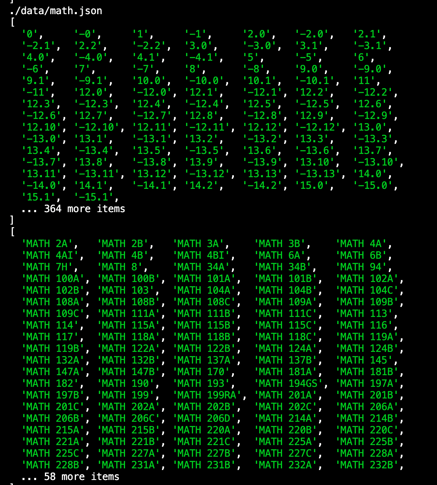

REMINDER: look into AA-ZZ course prereqs (MAth 104a requires CMPSC 5AA-ZZ)

okay, so here is what the data that you're going to be given looks like for math.

the nodes (below) are self explanatory -- these are just the names of each of the classes. this is the only data actually stored in the node.

the edges (above) are kinda weird. so each number is the key for an edge (so it's the value you can use to access that edge). each edge is directed, so its kinda like having an arrow pointing from A to B as opposed to a line connecting A and B. 

the edges that point from prerequisite to postrequisite are positive or 0 and the edges that point from postrequisite to prerequisite are negative or -0. for every positive-key edge, there is one negative-key edge, for that reason. 

the actual numerical value is very important as well. for example, if you see [23 24.0 24.1 24.2 25], that means that the student must complete any one of 24.0, 24.1, 24.2, but NOT all of them (i.e. this is OR instead of AND).

to make your life a little easier, i've created a function that should grab the information of a certain class if you pass in the path to the course along with the course name, so that you don't have to get more acquainted with the json objects than necessary. the function is called grabInfo. 
i'm not as well acquainted with the rest of this, but i think that what you'll have to do is
1. iterate through the nodes and create course blocks on react for each node
2. iterate through the edges and create arrows pointing from prereq to postreq
this is the section on graphology for iteration: https://graphology.github.io/iteration.html